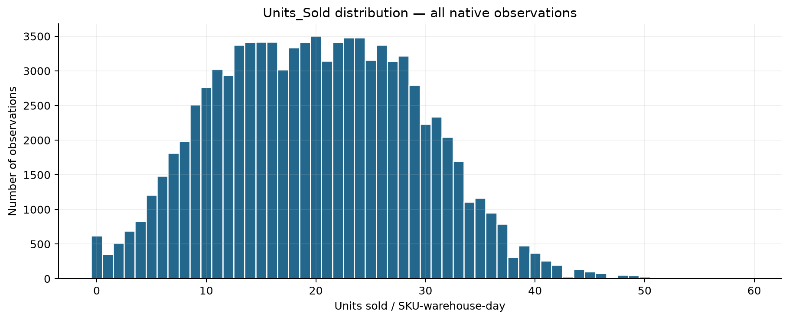
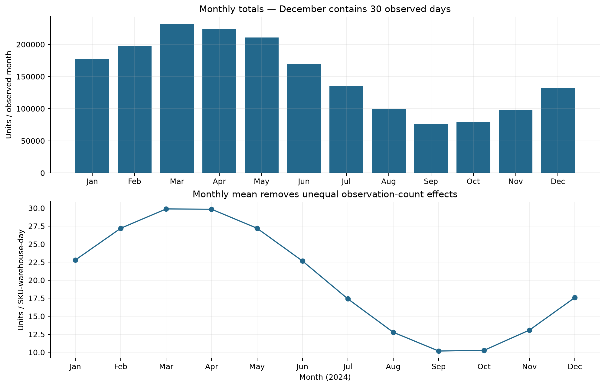
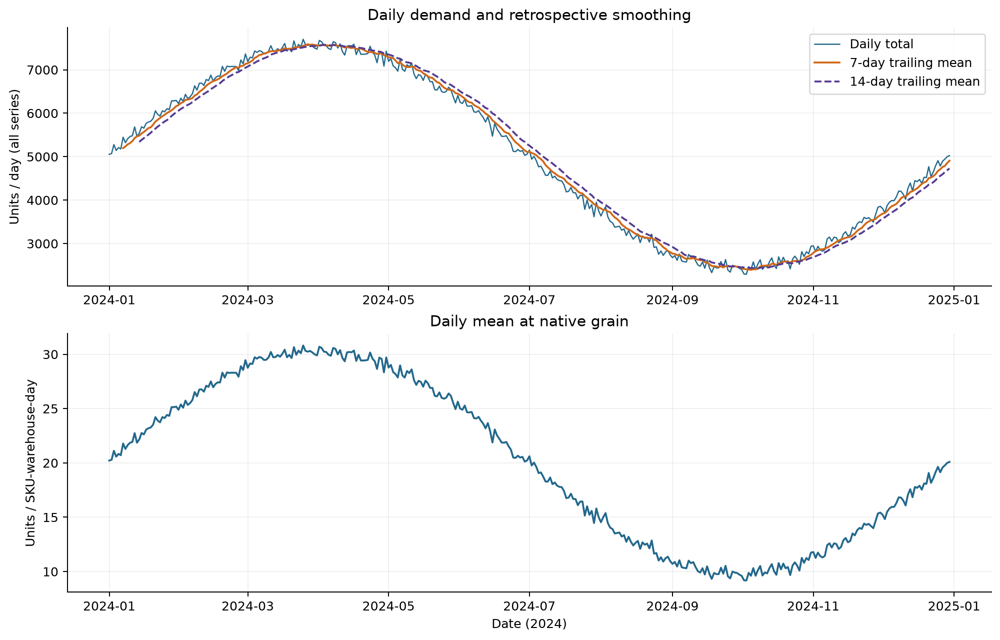
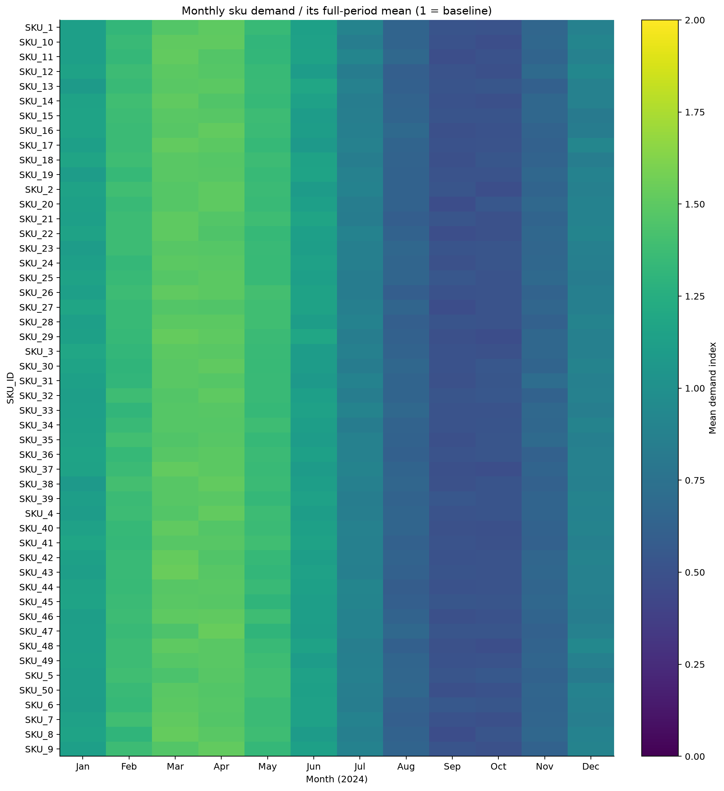
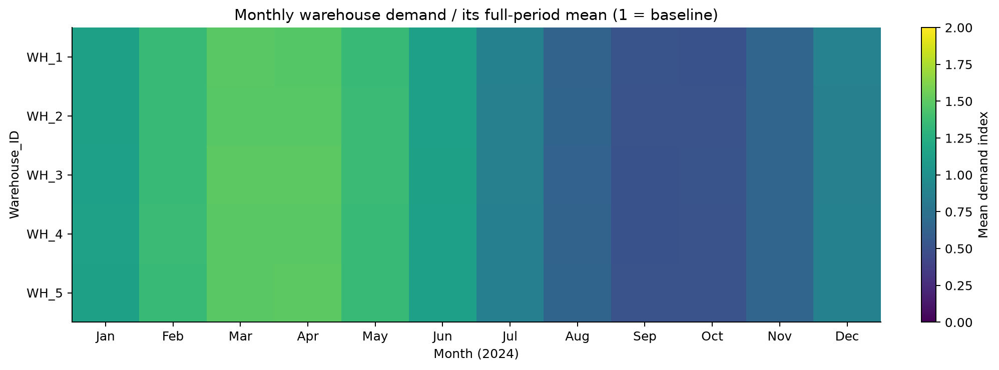
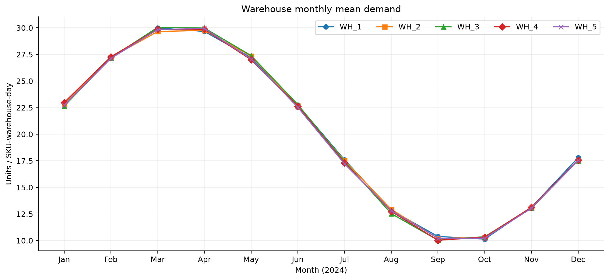
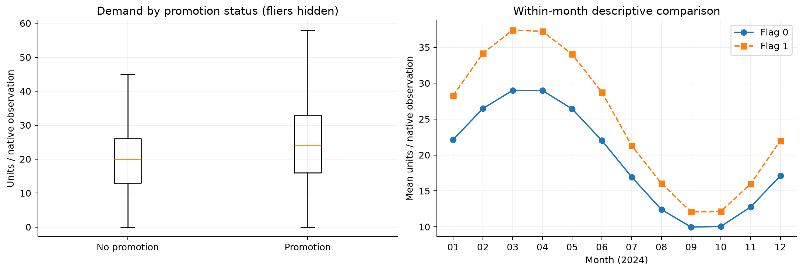
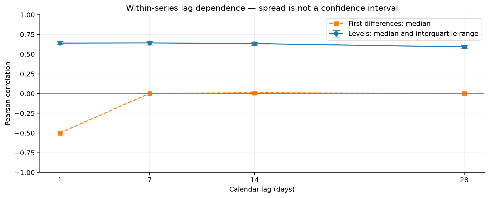

# Demand exploratory data analysis

> **Historical EDA provenance — notice added 2026-09-29:** The descriptive results and original methodology wording below are preserved from the earlier research stage; they do not define the current feature set, horizons or experiment authority. References to 1/7/14-day horizons, an unselected lag set or an untouched holdout are historical. The current [frozen feature contract](../docs/forecasting-feature-engineering.md) and [methodology/provenance record](../docs/forecasting-methodology-revision.md) govern forecasting. Final evaluation is December 3–30, 2024, origin December 2, reserved from subsequent selection/fitting but not fully unseen historically: December 3–16 had prior validation exposure and full-year EDA inspected the interval. No results were regenerated or tests/experiments executed for this notice.

**Scope:** Local simulated supply-chain data; `Units_Sold` at `Date + SKU_ID + Warehouse_ID`. No model training, final feature engineering, validation folds or new research decisions.

## Reproduction and provenance

Use the repository virtual environment and install `requirements-dev.txt`. Only after a separately reviewed scope authorization, replace the date placeholders below. Set the notebook SCOPE_START/SCOPE_END explicitly before execution; its stored full-year outputs are historical evidence, not permission to revisit reserved outcomes. The historical report renderer requires the documented full-source profile and must not relabel a partial scope as that evidence. From the repository root, the entry points are:

```bash
.venv/bin/python -m src.analysis.demand_exploratory_analysis --start YYYY-MM-DD --end YYYY-MM-DD
.venv/bin/python - <<'PY'
import nbformat
from nbclient import NotebookClient
p = 'notebooks/eda/demand_eda.ipynb'
nb = nbformat.read(p, as_version=4)
NotebookClient(nb, timeout=180, kernel_name='python3', resources={'metadata': {'path': '.'}}).execute()
nbformat.write(nb, p)
PY
```

The notebook uses the shared scoped loader/validator, displays summary tables and every figure inline, then saves those same figure objects as PNGs. It regenerates this report. Full generated tables stay under ignored `data/processed/demand_eda/`. The executed notebook contains aggregate outputs, not source-record previews.

| item | value |
| --- | --- |
| source_file | supply_chain_dataset1.csv |
| sha256 | 76dad280541a60f135442f3eeb3ef4804a28e48f6a9677f63ddba236ddc80491 |
| bytes | 6552486 |
| pandas | 3.0.6 |
| numpy | 2.5.3 |

## Verified validation and cleaning

All implemented quality checks passed. No rows were dropped, imputed, clipped or aggregated at the native key. Cleaning was limited to in-memory date/numeric parsing and chronological sorting.

| check | documented | observed | matches |
| --- | --- | --- | --- |
| rows | 91250 | 91250 | True |
| columns | 15 | 15 | True |
| dates | 365 | 365 | True |
| skus | 50 | 50 | True |
| warehouses | 5 | 5 | True |
| date_min | 2024-01-01 | 2024-01-01 | True |
| date_max | 2024-12-30 | 2024-12-30 | True |
| suppliers | 10 | 10 | True |
| regions | 4 | 4 | True |
| stockout_zero_rows | 91250 | 91250 | True |
| nonzero_order_rows | 5027 | 5027 | True |

Coverage is measured for every observed SKU × warehouse combination against the global observed daily span, so missing edge days or an entirely absent combination cannot be hidden by each series' own span. Cardinalities and endpoints are separately compared with the documented baseline. Every current series has 365 dates; all 250 series occur on every observed day. The span ends 2024-12-30: December has 30/31 days and the leap year has 365/366 calendar dates. December 31 is outside the observed source span; it is not silently added or treated as zero demand.

No missing/blank cells, invalid dates, duplicate native keys, negative count/cost/price values, fractional count values, non-finite numbers or non-binary flags were found. Observed ranges are descriptive, not newly approved bounds. `Demand_Forecast` is inspected only as source-quality metadata and is excluded from every demand calculation. `Stockout_Flag` remains zero-variance and is not a validation label.

| column | min | max | mean | median |
| --- | --- | --- | --- | --- |
| Units_Sold | 0.0000 | 59.0000 | 20.0546 | 20.0000 |
| Inventory_Level | 168.0000 | 990.0000 | 471.5223 | 461.0000 |
| Supplier_Lead_Time_Days | 2.0000 | 14.0000 | 7.9840 | 8.0000 |
| Reorder_Point | 201.0000 | 398.0000 | 300.0680 | 300.0000 |
| Order_Quantity | 0.0000 | 499.0000 | 19.2725 | 0.0000 |
| Unit_Cost | 5.0200 | 19.7600 | 12.2033 | 11.9900 |
| Unit_Price | 6.9500 | 35.1000 | 18.2618 | 18.1800 |
| Promotion_Flag | 0.0000 | 1.0000 | 0.1016 | 0.0000 |
| Stockout_Flag | 0.0000 | 0.0000 | 0.0000 | 0.0000 |
| Demand_Forecast | 0.0000 | 61.4200 | 20.0820 | 19.9500 |

## Overall demand and temporal extremes

Total demand is 1,829,979 units. There are 620 zero-demand observations (0.679%). Native-series means range from 19.455 to 20.721 units; median coefficient of variation is 0.452184.

| statistic | Units_Sold |
| --- | --- |
| count | 91,250.0000 |
| mean | 20.0546 |
| std | 9.0686 |
| min | 0.0000 |
| 1% | 1.0000 |
| 5% | 6.0000 |
| 25% | 13.0000 |
| 50% | 20.0000 |
| 75% | 27.0000 |
| 95% | 35.0000 |
| 99% | 41.0000 |
| max | 59.0000 |

The largest daily total is 7,702 on 2024-03-25; the smallest is 2,294 on 2024-10-03. The extreme tables rank observations, not statistical anomalies or records to remove. Large day-to-day moves are retained and have no inferred holiday explanation.

| kind | Date | total | mean |
| --- | --- | --- | --- |
| highest daily totals | 2024-03-25 00:00:00 | 7702 | 30.8080 |
| highest daily totals | 2024-04-01 00:00:00 | 7674 | 30.6960 |
| highest daily totals | 2024-03-21 00:00:00 | 7665 | 30.6600 |
| highest daily totals | 2024-04-02 00:00:00 | 7645 | 30.5800 |
| highest daily totals | 2024-04-07 00:00:00 | 7645 | 30.5800 |
| lowest daily totals | 2024-10-03 00:00:00 | 2294 | 9.1760 |
| lowest daily totals | 2024-10-02 00:00:00 | 2298 | 9.1920 |
| lowest daily totals | 2024-09-18 00:00:00 | 2331 | 9.3240 |
| lowest daily totals | 2024-09-26 00:00:00 | 2343 | 9.3720 |
| lowest daily totals | 2024-09-25 00:00:00 | 2390 | 9.5600 |

Largest absolute changes from the preceding day (ranked, not anomaly classifications):

| Date | total | change | change_pct |
| --- | --- | --- | --- |
| 2024-01-07 00:00:00 | 5447 | 269.0000 | 5.1951 |
| 2024-04-29 00:00:00 | 7084 | -309.0000 | -4.1796 |
| 2024-04-30 00:00:00 | 7428 | 344.0000 | 4.8560 |
| 2024-05-06 00:00:00 | 7244 | 277.0000 | 3.9759 |
| 2024-06-16 00:00:00 | 5769 | 298.0000 | 5.4469 |
| 2024-07-25 00:00:00 | 3788 | -323.0000 | -7.8570 |
| 2024-07-29 00:00:00 | 3617 | -278.0000 | -7.1374 |
| 2024-07-30 00:00:00 | 3952 | 335.0000 | 9.2618 |
| 2024-08-24 00:00:00 | 2911 | -304.0000 | -9.4557 |
| 2024-10-27 00:00:00 | 2814 | 291.0000 | 11.5339 |



## Monthly behaviour and smoothing

The highest monthly mean is 2024-03 (29.883 units per SKU-warehouse-day); the lowest is 2024-09 (10.174), a 2.94× ratio. Monthly totals reflect month length as well as demand level. These are observed within-year patterns, not evidence of recurring annual seasonality.

Monthly mean denominator = native observations; mean daily total denominator = observed dates. Month-to-month percentage change uses the preceding observed month; the first change is undefined.

| month | days | calendar_days | total | mean | total_change_pct | mean_change_pct | zero_share |
| --- | --- | --- | --- | --- | --- | --- | --- |
| 2024-01 | 31 | 31 | 176681 | 22.7975 | — | — | 0.0000 |
| 2024-02 | 29 | 29 | 197188 | 27.1983 | 11.6068 | 19.3038 | 0.0000 |
| 2024-03 | 31 | 31 | 231596 | 29.8834 | 17.4493 | 9.8720 | 0.0000 |
| 2024-04 | 30 | 30 | 223793 | 29.8391 | -3.3692 | -0.1482 | 0.0000 |
| 2024-05 | 31 | 31 | 210841 | 27.2053 | -5.7875 | -8.8266 | 0.0000 |
| 2024-06 | 30 | 30 | 170013 | 22.6684 | -19.3644 | -16.6765 | 0.0000 |
| 2024-07 | 31 | 31 | 134915 | 17.4084 | -20.6443 | -23.2042 | 0.0008 |
| 2024-08 | 31 | 31 | 99019 | 12.7766 | -26.6064 | -26.6064 | 0.0120 |
| 2024-09 | 30 | 30 | 76304 | 10.1739 | -22.9400 | -20.3714 | 0.0280 |
| 2024-10 | 31 | 31 | 79599 | 10.2708 | 4.3183 | 0.9531 | 0.0319 |
| 2024-11 | 30 | 30 | 98105 | 13.0807 | 23.2490 | 27.3573 | 0.0083 |
| 2024-12 | 30 | 31 | 131925 | 17.5900 | 34.4733 | 34.4733 | 0.0003 |



Trailing 7- and 14-day averages summarize the displayed day and preceding days. The first 6 and 13 outputs respectively are undefined because a full window is required. These retrospective EDA summaries are not forecasting features; smoothing alone is not evidence of predictive skill.



## SKU and warehouse comparisons

Across 50 skus, median pairwise correlation of the 12 monthly mean profiles is 0.997155 (minimum 0.990320). Within-sku highest/lowest monthly mean ratios range from 2.79 to 3.23. Broad temporal shapes are similar; this evidence does not suggest strongly distinct sku patterns at monthly resolution. Aggregation can conceal daily differences, and correlation does not establish equal levels or forecasting performance.



Across 5 warehouses, median pairwise correlation of the 12 monthly mean profiles is 0.999767 (minimum 0.999685). Within-warehouse highest/lowest monthly mean ratios range from 2.92 to 2.99. Broad temporal shapes are similar; this evidence does not suggest strongly distinct warehouse patterns at monthly resolution. Aggregation can conceal daily differences, and correlation does not establish equal levels or forecasting performance.

Profile indices divide each entity's monthly mean by its own full-observed-period mean; 1 is its baseline. These are retrospective descriptive normalizations only. Pairwise correlations use 12 monthly means, with each distinct entity pair counted once.





## Promotion relationship

Promotion rows number 9,270, with mean demand 24.915; non-promotion rows number 81,980, with mean 19.505. The unadjusted difference is 5.410 units (27.74%). Monthly and within-series comparisons provide descriptive context, not causal identification or permission to use future promotion flags.

| Promotion_Flag | rows | mean | median | std | zero_share |
| --- | --- | --- | --- | --- | --- |
| 0 | 81980 | 19.5050 | 20.0000 | 8.6085 | 0.0067 |
| 1 | 9270 | 24.9149 | 24.0000 | 11.3085 | 0.0076 |



## Lag evidence

Median level correlations at lags 1, 7, 14 and 28 are 0.640, 0.642, 0.633 and 0.592. After first differencing, medians at lags 7, 14 and 28 are 0.003, 0.010 and 0.002. Broad level movement may contribute substantially to raw dependence; lag 7 is not uniquely elevated. Differencing is a diagnostic, not an approved preprocessing choice. Its negative lag-1 correlation can arise mechanically. No final lag set is selected.

Correlations are Pearson correlations of each complete, date-sorted native series with itself shifted by the stated calendar lag. Undefined/constant correlations are omitted from summaries and counted by `defined_series`. No series are concatenated across boundaries. Interquartile ranges describe between-series spread, not confidence intervals.

| lag_days | defined_series | median | q25 | q75 | min | max | differenced_median |
| --- | --- | --- | --- | --- | --- | --- | --- |
| 1 | 250 | 0.6401 | 0.6191 | 0.6593 | 0.5405 | 0.7091 | -0.4991 |
| 7 | 250 | 0.6425 | 0.6178 | 0.6623 | 0.5513 | 0.7294 | 0.0030 |
| 14 | 250 | 0.6332 | 0.6140 | 0.6489 | 0.5528 | 0.7057 | 0.0103 |
| 28 | 250 | 0.5921 | 0.5748 | 0.6108 | 0.5041 | 0.6594 | 0.0015 |



## Evidence for future expanding-window validation

| quarter | days | mean | std | zero_share | promotion_share |
| --- | --- | --- | --- | --- | --- |
| 2024Q1 | 91 | 26.6138 | 6.4698 | 0.0000 | 0.1015 |
| 2024Q2 | 91 | 26.5779 | 6.4546 | 0.0000 | 0.1007 |
| 2024Q3 | 92 | 13.4886 | 6.1255 | 0.0134 | 0.1026 |
| 2024Q4 | 91 | 13.6101 | 6.1413 | 0.0137 | 0.1015 |

The monthly and quarterly summaries show differing demand levels across the observed year. Expanding-window evaluation origins spaced across the year could therefore test materially different demand levels and transitions, whereas adjacent origins could cover similar periods. This is evidence to consider, not proof of differing model performance. Later design must balance initial history, the approved 1-/7-/14-day horizons, available future outcomes, possible overlap between evaluation windows, and an untouched final holdout. Full-year EDA has already exposed broad future-period patterns, so this influence on validation design must be disclosed. No fold dates, final split, seasonal regimes or models are defined here.

## Limitations and decision-record consistency

- This is simulated data, not evidence from an operating retailer.
- One observed within-year cycle cannot establish recurring annual seasonality. No Sri Lankan holiday or other external-event effects are inferred.
- `Units_Sold` is the approved demand proxy; zero-variance `Stockout_Flag` cannot verify unconstrained demand or observed stockouts.
- Promotion differences and temporal correlations are descriptive and may reflect simulation design or confounding. No causal effects or significance tests are claimed.
- Monthly aggregation smooths native daily heterogeneity. Full-year normalization and differencing are EDA diagnostics, not model features.
- Validation rules detect specified defects, not every possible semantic error. Unexpected defects require an explicit handling decision rather than automatic repair.
- The verified counts, native grain, median coefficient of variation, median zero-demand share and lag-1 correlation agree with the existing profile and DR-002. Nothing here contradicts DR-003 or DR-004; no decision record was changed.

## Project references

[Dataset contract](../docs/dataset.md), [prior temporal profile](temporal-demand-profile.md), [DR-002](../docs/decisions/DR-002-forecasting-analytical-unit.md), [DR-003](../docs/decisions/DR-003-forecasting-feature-engineering-baseline.md), [DR-004](../docs/decisions/DR-004-forecast-horizons.md).
